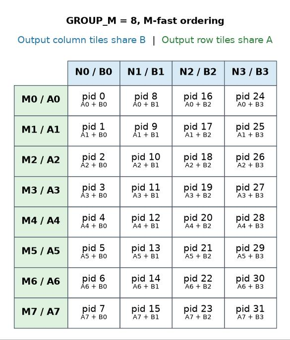
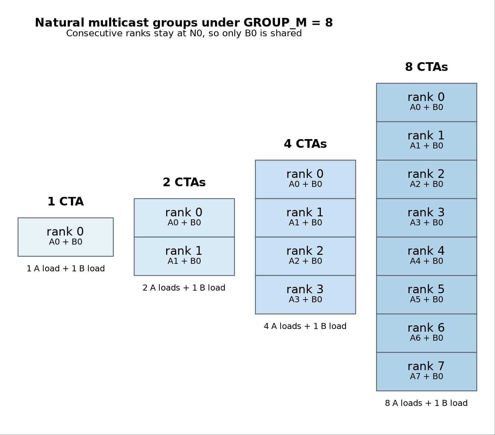
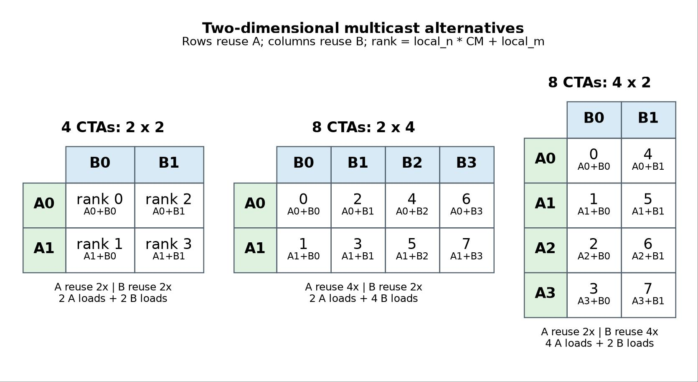

# TMA multicast support in Triton

**Scope:** Regular Triton (no TLX/Gluon) on Hopper+

This document specifies opt-in, compiler-selected TMA multicast for standard
Triton: the `multicast` kernel option, the tri-state descriptor-load override,
compiler-derived broadcast axes and recipient masks, and NVIDIA TMA lowering.
The user grants permission for multicast; the compiler proves a legal recipient
group and decides whether to emit it.

## Background

### What TMA multicast is

TMA multicast is an NVIDIA Hopper+ hardware operation in which one Tensor Memory
Accelerator load copies a global-memory tile into the shared memory of multiple
CTAs in the same hardware cluster. PTX represents it with
`cp.async.bulk.tensor...multicast::cluster` and a 16-bit recipient CTA mask.

The optimization applies when multiple clustered CTAs consume the same source
tile. It can reduce global and L2 source traffic from one load per CTA to one
load per recipient group. It does not share one physical shared-memory buffer:
each recipient CTA receives its own copy, so per-CTA shared-memory capacity is
unchanged.

TMA multicast is distinct from several nearby mechanisms:

| Mechanism | Data movement or coordination | Relationship to multicast |
|---|---|---|
| TMA multicast | One global tile is delivered to several CTAs' shared memory | Subject of this document |
| 2-CTA MMA | Two CTAs contribute separate operand partitions to one MMA operation | Orthogonal; the source tiles need not be broadcast |
| Cluster Launch Control | Work scheduling information is broadcast within a cluster | Control flow, not operand movement |
| Distributed shared memory | CTAs access or exchange peer shared memory | Does not perform a TMA broadcast |
| Grouped program-ID ordering | Nearby programs request reusable tiles | Improves locality but does not create a hardware cluster or multicast load |

### Ecosystem context: TLX and Gluon

TMA multicast already exists elsewhere in the Triton ecosystem, in two forms that
inform this design:

- **Layout-derived intent (upstream Gluon).** The NVIDIA backend
  models multicast with a boolean attribute on TMA load and gather operations;
  the recipient group and its representative CTA are derived from broadcast
  dimensions in the destination shared-memory `cga_layout`. A request is only
  meaningful when that layout has a CTA broadcast dimension. Gluon exposes this
  through `multicast=True` on TMA loads together with explicit multi-CTA layouts,
  with end-to-end backend, verifier, PTX-lowering, memory-ordering, sanitizer,
  and test support. This is not extended to Triton.

- **Explicit recipient masks (TLX).** TLX adds a `multicastTargets` operand to
  the TMA load. `tlx.async_descriptor_load(..., multicast_targets=[...])` accepts
  CTA indices, constructs a recipient bitmask, and threads it through the IR to
  PTX lowering, emitting real `.multicast::cluster` instructions. This makes the
  recipient set explicit at the load site.

The standard `triton.language` frontend exposes neither model today: a descriptor
load cannot request multicast, and `num_ctas > 1` alone neither selects
recipients nor promotes a normal load to multicast. This document adds a third
model — **compiler-selected** multicast — in which the user grants permission and
the compiler derives the recipient set from tile reuse. Explicit CTA masks are
not part of the standard Triton programming model.

### Cluster geometry and program IDs under `ctas_per_cga`

The design derives recipients from the configured cluster shape, so it depends on
how that shape and per-CTA program IDs behave.

`ctas_per_cga=(x, y, z)` is a static compilation option: it participates in the
compilation hash, normalizes to `cluster_dims`, is attached to the module as
`ttg.cluster-dim-{x,y,z}`, and is emitted as the kernel's required cluster shape
(`.reqnctapercluster`). Compiler passes can therefore query the exact tuple at
compile time. Standard `triton.language` source, however, has no
`tl.ctas_per_cga()` builtin; the tuple is not injected into kernel source as a
constexpr. (Gluon exposes `gl.num_ctas()` as a compile-time value; TLX exposes
runtime `cluster_cta_rank()` / `cluster_size_1d()` but not the per-axis tuple.)

`ctas_per_cga` groups CTAs already present in the launch grid into an explicit
multi-dimensional cluster and forces the internal `num_ctas` option to one. It
does not multiply or reinterpret the launch grid the way upstream `num_ctas`
does, so the two option names are not interchangeable merely because both cluster
CTAs.

Because the internal `num_ctas` value is one, `tl.program_id(axis)` lowers to
`blockIdx.axis` — the CTA's own block coordinate, not a shared cluster ID. For
`ctas_per_cga=(DX, DY, DZ)` and a valid clustered launch (grid extent divisible
by the cluster extent on each axis):

```text
program_id(axis) = cluster_id(axis) * D_axis + local_axis,  0 <= local_axis < D_axis
cluster_rank     = local_x + DX * (local_y + DY * local_z)
```

Consequently:

- CTAs in one cluster share `program_id(axis)` exactly when `D_axis == 1`.
- When `D_axis > 1`, CTAs with the same `local_axis` form subgroups that share
  that axis value; distinct CTAs never share the full `(pid_x, pid_y, pid_z)`
  tuple.
- A shared cluster-level ID is derived as `program_id(axis) // D_axis`; it is not
  what `tl.program_id(axis)` returns on this path.

For example, `ctas_per_cga=(1, 4, 1)` gives four CTAs that share `program_id(0)`
but have four different `program_id(1)` values (the multi-CTA layer-normalization
tutorial uses this so every CTA selects the same row); `ctas_per_cga=(2, 4, 1)`
covers a `2 x 4` block of adjacent X and Y IDs. Multicast analysis reads `D_axis`
from the module attributes and derives `cluster_id` / `local_axis` directly; it
does not rely on kernel source receiving those dimensions.

`preferred_ctas_per_cga` is a different contract — a preferred shape with a
fallback — and is out of scope; the initial design assumes an exact required
`ctas_per_cga` shape. Upstream Triton's `num_ctas > 1` path instead makes
`tl.program_id(axis)` the shared cluster ID. The analysis below is defined from
each CTA's actual source-tile calculation, so it reasons about either PID
convention without assuming all CTAs see one raw program ID.

### Detailed Motivating example: GEMM

A standard grouped GEMM orders output tiles so that it advances through several M
tiles before advancing N. Each output tile `C(m,n)` consumes `A(m,k)` and
`B(k,n)` during one K-loop stage.



Within one output-tile rectangle, CTAs with the same M coordinate consume the
same A tile, and CTAs with the same N coordinate consume the same B tile. The
ordinary grouped order encourages cache reuse but issues one load per CTA. TMA
multicast can remove redundant source loads only when the programs are also
members of a compatible hardware CTA cluster.

**One-dimensional recipient groups.** If a cluster extends only along M, its CTAs
consume distinct A tiles and one common B tile. For `P` CTAs, source loads per K
stage change from `P A + P B` to `P A + 1 B`.



| CTA count | Output-tile shape `(CM x CN)` | A loads | B loads | Reduction when A and B tiles are equal-sized |
|---:|---:|---:|---:|---:|
| 1 | `1 x 1` | 1 | 1 | 0% |
| 2 | `2 x 1` | 2 | 1 | 25% |
| 4 | `4 x 1` | 4 | 1 | 37.5% |
| 8 | `8 x 1` | 8 | 1 | 43.75% |

**Rectangular recipient groups.** A `CM x CN` output-tile rectangle exposes both
reuse directions: A is shared by the `CN` CTAs at one M coordinate, and B by the
`CM` CTAs at one N coordinate.



| Shape | A multicast fanout | B multicast fanout | Unique A loads | Unique B loads |
|---:|---:|---:|---:|---:|
| `2 x 2` | 2 | 2 | 2 | 2 |
| `2 x 4` | 4 | 2 | 2 | 4 |
| `4 x 2` | 2 | 4 | 4 | 2 |
| `8 x 1` | 1 | 8 | 8 | 1 |

For equal K depth, approximate source bytes per stage are
`element_bytes * BLOCK_K * (CM * BLOCK_M + CN * BLOCK_N)`, versus
`element_bytes * BLOCK_K * CM * CN * (BLOCK_M + BLOCK_N)` without multicast. The
best rectangle depends on operand tile sizes, cluster limits, and edge
frequency; the traffic model alone does not select a universal shape.

Each CTA still computes one complete `BLOCK_M x BLOCK_N` output tile, so multicast
reduces source traffic but not recipient storage: per CTA and per pipeline stage,
operand shared memory remains approximately
`element_bytes * BLOCK_K * (BLOCK_M + BLOCK_N)`. Cluster-shape and tile-size
trade-offs are tuning-policy choices, not multicast correctness requirements.

## Design

### Goals

- Define coherent standard-Triton semantics for TMA multicast.
- Cover the GEMM reuse patterns represented by one-dimensional and rectangular
  CTA clusters.
- Make the relationship among program scheduling, cluster geometry, shared
  layout, recipient selection, and synchronization unambiguous.
- Establish observable correctness, diagnostic, and performance requirements.
- Preserve a path to alignment with upstream Triton's supported backend model.

### Non-goals for this revision

- Selecting a default cluster shape or autotuning policy.
- Extending multicast to stores, reductions, or scatter.
- Treating 2-CTA MMA, CLC, or distributed shared memory as multicast features.

### Semantic constraints

Any implementation must account for the following hardware and program
properties, turning each into a language guarantee, a compile-time legality
condition, a runtime condition, or documented undefined behavior:

- All recipients of one multicast transaction are CTAs in the same hardware
  cluster, and the recipient mask names only valid cluster ranks.
- Recipients agree on the source tile, destination shape, type, and pipeline
  stage for a multicast transaction.
- Each recipient has compatible destination shared storage even though only one
  source transaction is issued.
- Issuance, transaction-byte accounting, and completion use cluster-compatible
  synchronization semantics.
- Every participating CTA observes completion before consuming a tile and before
  a later stage reuses its destination buffer.
- Predication and partial output tiles do not leave participating CTAs outside a
  collective synchronization protocol.

### Decision summary

The design combines explicit user policy with automatic compiler selection:

| Concern | Decision |
|---|---|
| Feature control | Multicast is opt-in through a kernel configuration. It is disabled by default. |
| Load-level control | Individual TMA loads can override the kernel policy, including disabling multicast for that load. |
| Cluster geometry | The configured `ctas_per_cga` tuple defines the physical CTA cluster considered by the analysis. |
| PID semantics | `ctas_per_cga` does not imply a shared raw program ID. The analysis evaluates the actual PID and cluster-local coordinate of every CTA. |
| Recipient selection | The compiler derives recipient groups by comparing the source tile ID computed by each CTA in the cluster. |
| Initial schedule scope | Non-persistent and statically persistent schedules whose per-CTA tile sequence can be derived at compile time. |
| Emission | The compiler emits multicast only when it proves a legal group and elects to use it. Opt-in does not guarantee multicast. |
| Explicit masks | Standard Triton users do not specify CTA recipient masks. Masks are a compiler-derived consequence of tile equivalence. |
| Fallback | A load remains an ordinary per-CTA TMA load when multicast is disabled, illegal, unprofitable, or cannot be proven safe. |

This separates two responsibilities. The user controls whether multicast is
permitted for the kernel or a particular load. The compiler controls whether it
is used and, when used, which CTAs receive each transaction.

### Current implementation

The initial implementation is intentionally narrower than the general
tile-equivalence model described below. It recognizes source-tile reuse by
tracking which `tl.program_id` axes each descriptor-load index depends on. A
physical cluster axis is a broadcast axis when its extent is greater than one
and none of the load indices depend on that program-ID axis. This proves
axis-aligned recipient groups; it does not yet symbolically compare arbitrary
tile expressions between CTA ranks.

The implementation flows through the compiler as follows:

1. The Python frontend records a load-local `tt.multicast` boolean when
   `TensorDescriptor.load(..., multicast=...)` overrides the kernel policy. The
   NVIDIA backend records the kernel default as `ttg.multicast` and the exact
   physical cluster shape through `ctas_per_cga` module attributes.
2. `TritonNvidiaGPUTMAMulticastPass`, implemented in
   `lib/Dialect/TritonNvidiaGPU/Transforms/TMAMulticast.cpp`, runs after
   descriptor-encoding optimization. For each enabled `tt.descriptor_load`, it
   computes program-ID dependencies and records the proven broadcast axes in
   the internal `tt.multicast_axes` attribute.
3. TMA lowering and software-pipelining preserve that attribute, allocate one
   completion barrier slot per recipient group, and insert cluster barriers
   around the multicast transaction. Loads with different broadcast axes are
   kept in different pipeline groups. Native `tl.range(...,
   warp_specialize=True)` lowering carries the same plan through its load
   partitions.
4. NVIDIA LLVM lowering derives a rank-dependent 16-bit recipient mask from the
   cluster shape and broadcast axes. Only the lowest-ranked CTA in each group
   issues `cp.async.bulk.tensor...multicast::cluster` and waits on the
   corresponding cluster-visible completion barrier; the following cluster
   barrier releases the other recipients.

The planner accepts only tiled `tt.descriptor_load` operations, an exact
power-of-two `ctas_per_cga` shape containing 2 to 16 CTAs, and index/control-flow
expressions whose program-ID dependencies it can prove. It conservatively
rejects memory-derived or atomic tile IDs, CLC operations, divergent surrounding
control flow, unsupported expression kinds, and Meta AutoWS (`ttg.use-meta-ws`).
CLC and dynamic-persistent schedules are unsupported because their regular
Triton schedulers do not yet support multi-CTA execution. When those schedulers
gain multi-CTA support, the multicast analysis must be extended to understand
their cluster-level work assignment and prove which per-CTA tiles remain shared.
It currently selects every proven broadcast axis and has no cost model or
user-facing optimization remarks. Selection can be inspected in TTGIR through
`tt.multicast_axes` and in PTX through `.multicast::cluster`.

The internal attribute is a compiler contract, not a user API. Standard Triton
users grant permission through the kernel option or load override; they do not
construct `tt.multicast_axes` or recipient masks themselves.

### TMA consumers, MMA completion, and transpose

A multicast TMA load still creates an ordinary local shared-memory copy in each
recipient CTA. An MMA reads its CTA's local copy in exactly the same way whether
that copy came from an ordinary TMA transaction or a multicast transaction.
Consequently, regular Triton does not need to mark `tl.dot` or the lowered MMA
as a "multicast consumer" merely to make the operand readable.

The separate issue is buffer lifetime. An asynchronous MMA must finish reading
a pipeline buffer in every recipient CTA before the issuing CTA can multicast a
later stage into the same per-CTA storage. Gluon exposes this coordination to
the kernel author. Its `tcgen05_mma(..., multicast=True)` passes the input shared
descriptors to the generated TCGen5 completion commit; their broadcast layouts
define a recipient mask, and the commit multicasts its mbarrier arrival. The
author also initializes the completion barrier with the corresponding number of
CTA commits. Thus, Gluon's flag describes how MMA *completion* is communicated,
not a different mechanism for reading the multicast TMA result.

Regular Triton instead lets the compiler own the producer-consumer protocol. In
the native warp-specialized pipeline used by the current GEMM implementation,
the pipelined load has a local empty/reuse barrier in each CTA. Each CTA's MMA
signals its own barrier when it has finished consuming that CTA's shared-memory
copy, and the producer waits on that local completion before attempting to reuse
the buffer. The compiler-inserted cluster barrier immediately before the next
multicast TMA transaction is reached only after these local waits. It therefore
guarantees that every recipient has finished with the previous contents before
the elected CTA overwrites the group. Other supported lowering paths preserve
the same lifetime through compiler scheduling and waits. Because completion is
compiler-managed rather than exposed as one cross-CTA MMA-completion contract,
the lowered regular-Triton MMA does not need Gluon's multicast flag or a
multicast TCGen5 completion commit.

This also means the multicast plan does not have to propagate through every
value transform between the load and its consumer. For example, a column-major
A tile can be loaded and transposed before the dot:

```python
# Cluster X selects M tiles; cluster Y selects N tiles.
# offs_am depends on X but not Y, so this load multicasts along Y.
a_storage = a_desc.load([offs_k, offs_am], multicast=True)
a = a_storage.T
acc = tl.dot(a, b.T, acc)
```

The planner analyzes the descriptor coordinates `[offs_k, offs_am]` and records
Y as the broadcast axis on the descriptor load. The TMA transaction delivers
the same column-major source tile to each recipient's local shared memory; `.T`
then changes the local tensor orientation used by `tl.dot`. It does not change
source-tile identity, recipient selection, or the TMA completion protocol. The
compiler follows the SSA use through the transpose when placing the consumer
release, so no transpose-specific multicast annotation is required. The same
reasoning applies to a transposed B load, with X as its broadcast axis.

If a future regular-Triton pipeline removes the pre-load cluster rendezvous or
uses a shared cross-CTA consumer-completion barrier, it will need to infer and
lower MMA-side completion metadata equivalent to Gluon's explicit contract.

### Public API

The kernel/configuration default is the boolean backend option `multicast`,
which defaults to `False`. Descriptor loads accept a tri-state override:

```python
tile = desc.load(offsets, multicast=None)   # inherit the kernel default
tile = desc.load(offsets, multicast=True)   # permit for this load
tile = desc.load(offsets, multicast=False)  # prohibit for this load
```

`True` grants permission; it does not guarantee that multicast is emitted. The
initial compiler implementation supports tiled descriptor loads with an exact
`ctas_per_cga` shape. Gather, im2col, preferred/fallback cluster shapes, CLC tile
IDs, atomic work-stealing tile IDs, Meta AutoWS schedules, and other non-static
or unsupported schedules fall back to ordinary per-CTA loads. Native
`tl.range(..., warp_specialize=True)` schedules are supported when their load
indices and surrounding control flow satisfy the static dependency analysis.

The initial profitability rule selects every legal equivalence group with more
than one recipient. The backend records compiler-derived broadcast axes on the
load, elects the lowest-ranked CTA in each group, and derives the 16-bit target
mask; standard Triton does not expose that mask to users.

### Global opt-in

The kernel configuration carries the default multicast policy for its TMA loads.
The default is disabled, preserving existing behavior. Enabling it gives the
compiler permission to consider eligible loads for multicast.

Opt-in is not a request for a particular cluster mask or a guarantee that the
generated kernel contains a multicast instruction. The same kernel may contain
ordinary and multicast TMA loads because different load sites can have different
tile-reuse patterns or legality constraints.

The policy is the boolean `multicast` compilation option and participates in
specialization and cache identity in the same way as other backend options.

### Per-load policy

Each TMA load inherits the kernel policy unless it has a load-local override. A
load can be marked ineligible for multicast even when the kernel configuration
enables it — needed for loads whose cost model, synchronization behavior, or
source expression makes multicast undesirable.

The override controls compiler policy, not the recipient set: `True` enables
analysis even when the global configuration is disabled, `False` disables
analysis for the load, and `None` inherits the global setting.

### Inputs to compiler selection

The selection decision is based on two inputs available during compilation:

1. **Cluster geometry.** `ctas_per_cga=(x, y, z)` defines the set of
   cluster-local CTA ranks and their coordinates. A missing or single-CTA cluster
   has no multicast opportunity.
2. **Tile identity.** For each candidate TMA load, the compiler determines the
   source tile requested by every CTA rank. Tile identity includes the descriptor
   or source allocation, tensor coordinates and offsets, tile shape, element type,
   and any values that change which source bytes the load reads.

The compiler treats the existing program-to-tile calculation as an input. This
design does not require multicast analysis to choose `ctas_per_cga`, change the
program-ID swizzle, or invent a different output-tile schedule. Configuration or
autotuning may select those values separately; multicast analysis then evaluates
the reuse that the selected mapping creates.

The analysis must use the PID convention of the selected launch path. For
`ctas_per_cga`, it evaluates the distinct `blockIdx`-based program IDs for all
cluster-local coordinates and must not replace them with one shared PID. Sharing
is established at the source-tile level: CTAs may compute different output tiles
while still requesting the same A or B input tile.

### Initial schedule scope

The initial scope is schedules where the compiler can express every CTA's tile
sequence statically as a function of cluster position and loop iteration:

- **Non-persistent schedules.** Each CTA processes the tile selected by its launch
  program IDs. The compiler substitutes the `ctas_per_cga` local coordinates into
  the program-to-tile calculation and compares the resulting TMA coordinates.
- **Statically persistent schedules.** Each CTA starts from a statically defined
  program ID and advances through a statically defined tile sequence, such as a
  fixed grid-stride loop. The comparison is performed for CTAs at the same
  logical loop iteration.

"Static" does not require every runtime M, N, or tile number to be a compile-time
constant. It requires the relationship among cluster-local rank, program ID,
iteration, and TMA coordinates to be symbolically known. Cluster members must
also progress through the relevant pipeline stages in a compatible order; if
different control flow prevents the compiler from pairing their load instances,
the load is not a multicast candidate.

### Tile-equivalence groups

For a candidate load `L`, cluster-local CTA rank `r`, and matched schedule
iteration `i`, let `TileId(L, r, i)` denote the source tile selected by that CTA.
The compiler partitions cluster ranks into equivalence groups for that load
instance:

```text
r1 and r2 are in the same group iff
TileId(L, r1, i) == TileId(L, r2, i).
```

A group with more than one active CTA is a multicast candidate. Singleton groups
retain ordinary per-CTA loads. One load site may produce multiple independent
multicast groups within the same cluster, and different operand loads may produce
different partitions. For a `CM x CN` GEMM cluster:

- An A load normally has one group per M coordinate (CTAs at different N
  coordinates share the same A tile).
- A B load normally has one group per N coordinate (CTAs at different M
  coordinates share the same B tile).
- In a `CM x 1` cluster, A groups are singletons while the B load has one group
  of size `CM`.
- In a `2 x 4` cluster, A has two groups of four CTAs and B has four groups of two
  CTAs.

This model naturally handles clusters where only one operand benefits, and avoids
requiring a kernel author to derive rank-dependent masks from cluster geometry.

### Extension to CLC and other dynamic schedules

Regular Triton's CLC and dynamic-persistent schedulers do not currently support
multi-CTA execution, so the initial multicast implementation rejects their tile
IDs and retains ordinary per-CTA loads. Multi-CTA scheduler support alone will
not make these loads eligible: the analysis will also need to understand the
new scheduling contract and prove how one cluster-level work assignment expands
into the source tiles requested by each CTA.

Cluster Launch Control replaces a statically known next tile with a dynamic work
assignment. If each CTA independently requests work and receives an unrelated tile
ID, the compiler cannot assume the CTAs request reusable operand tiles; the
default result for that schedule is no TMA multicast, even though the CTAs remain
in one hardware cluster.

The model generalizes when scheduling has a **cluster-level work assignment**. Let
`W_i` be an opaque dynamic work token shared by all CTAs in the cluster for
iteration `i`. Each CTA derives its output tile from that token and its local
coordinate:

```text
output_tile(r, i) = ExpandClusterWork(W_i, local_coord(r))
TileId(L, r, i)   = SourceTile(L, output_tile(r, i))
```

The compiler does not need the runtime value of `W_i`. It needs a guarantee that
every participating CTA observes the same token and a statically known
`ExpandClusterWork` mapping; it can then compare the symbolic source-tile
expressions exactly as for a static schedule. For a rectangular GEMM, `W_i`
identifies the cluster's output macro-tile and `local_coord(r)` selects one CTA
output tile within that rectangle; the CTAs have different output-tile IDs, but
the derived A and B source tiles still form the row and column equivalence groups
above. The shared quantity is the cluster work assignment or base PID, not the
final per-CTA tile ID.

CLC can provide this contract as either a single logical cluster work ID
distributed to all CTAs (which expand it using their cluster-local coordinates),
or the base CTA ID of a dynamically acquired cluster (each CTA reconstructs its
program IDs by adding its local coordinates). Blackwell CLC exposes the first CTA
ID of a canceled cluster and can multicast a cancellation result across the
cluster, demonstrating that a shared dynamic assignment is possible. The design
requirement is the cluster-level scheduling contract, not a specific CLC API
sequence.

TLX already implements a one-dimensional version of the second form: with
`multi_ctas=True`, the CLC response containing the canceled cluster's first CTA ID
is delivered to every CTA, and querying it adds `cluster_cta_rank()` to the
returned X coordinate so CTAs receive distinct, adjacent tile IDs from one shared
base. This is compatible with a one-dimensional X cluster and a linear tile
schedule. Rectangular clusters require the expansion rule to be made explicit;
adding a flattened cluster rank to X is not the same as applying `local_x` and
`local_y` to a `CM x CN` rectangle. Two general forms are possible: preserve a
three-dimensional base CTA ID and add each per-axis local coordinate before the
tile swizzle, or treat the canceled work as a linear cluster work ID with a
cluster-aware expansion mapping `(work_id, cluster_rank)` to the rectangle.
Either supports multicast if the mapping is common to all CTAs and visible to
compiler analysis; selecting the CLC work-ID contract is a remaining scheduler
decision.

A design in which CTAs acquire unrelated work would require runtime matching or
regrouping of tile IDs before a TMA load, which is outside the initial scope; such
kernels retain per-CTA loads unless their scheduler exposes a stronger
cluster-level relationship.

### Proof and profitability

Multicast is selected only when the compiler can establish both legality and an
expected benefit. The legality proof must establish at least:

- Equal source tile identity for every recipient in a group.
- Compatible destination shared-memory storage and load types.
- A valid recipient group within the configured hardware cluster.
- Compatible predicates and participation for every collective operation.
- A synchronization protocol that preserves the original load's visibility and
  pipeline-buffer lifetime.

Failure to prove any condition leaves the original per-CTA loads intact. Because
multicast is an optional optimization, declining it is not a compilation error
(although malformed explicit policy, such as requesting the feature on an
unsupported target, may still be diagnosed). After legality, the compiler may
decline multicast when its cost model predicts that transaction savings do not
outweigh cluster synchronization, occupancy, or other execution costs. The
initial implementation has no such cost model and selects every group proven by
its axis-invariance analysis; production profitability thresholds and tuning
controls remain open.

### Compiler-owned consequences

Once a tile-equivalence group is selected, the compiler owns the derived details
needed to preserve the original program semantics:

- The recipient mask for each distinct tile.
- Selection of the issuing CTA for that group.
- A destination shared-memory layout compatible with the recipient group.
- Cluster-scoped completion and transaction-byte accounting.
- Producer/consumer synchronization, including pipeline reuse and MMA completion
  requirements.

These are not additional user inputs in the automatic model. The configured
cluster geometry and the program's tile calculation are authoritative; derived
masks and layouts must agree with them.

### Predication and edge tiles

Tile identity alone is insufficient when cluster members have different
predicates. A recipient group also needs a compatible participation set. If the
compiler cannot prove that the selected collective remains convergent and that
every recipient has valid destination storage, it retains ordinary loads for that
site or edge path. This permits full-tile GEMM groups to use multicast without
requiring partial M groups or N rectangles to use the same recipient partition.
The detailed policy for statically smaller groups, dynamically predicated groups,
and separate edge configurations remains open.

### Observability

Numerical correctness cannot show whether multicast was selected because the
fallback load has the same semantics. The design therefore requires an observable
way to distinguish:

- Analysis disabled by policy.
- No reusable tile-equivalence group found.
- A candidate rejected for legality.
- A legal candidate rejected by profitability.
- Multicast emitted, including its recipient grouping.

The exact mechanism may be compiler remarks, generated-code metadata, or another
existing Triton diagnostic facility. PTX inspection remains useful for compiler
tests but is not sufficient as the only user-facing explanation.

### Remaining decisions

- Unsupported-target diagnostics beyond the current conservative fallback.
- Which load-like operations are initially eligible: tiled descriptor load only,
  or gather and im2col as well.
- The exact definition and analysis of tile identity across descriptor creation,
  arithmetic, loops, and warp-specialized regions.
- The exact CLC abstraction that communicates one dynamic cluster work assignment
  and its local-coordinate expansion to compiler analysis.
- Whether dynamically conditional recipient groups are permitted beyond a shared
  opaque cluster work token with a static per-rank expansion.
- Profitability thresholds and whether users can request legality-only selection.
- Edge behavior for partial clusters and nonuniform predicates.
- The representation used to reconcile the layout-derived backend with the
  explicit-mask backend.
- The diagnostic and optimization-reporting interface.

### Validation criteria

Evaluation must separate:

- Functional correctness across full and edge tiles.
- Correct identification of tile-equivalence groups for one-dimensional and
  rectangular clusters.
- Correct PID and tile-sequence analysis for non-persistent and statically
  persistent schedules using `ctas_per_cga`.
- Correct propagation of a shared cluster work assignment through a multi-CTA CLC
  schedule, with distinct per-CTA output tiles and reusable operand partitions.
- Rejection of multicast when dynamically scheduled CTAs receive unrelated work.
- Emission of the intended multicast transaction and derived recipient masks.
- Correct fallback when equivalence, participation, or legality cannot be proven.
- Correct behavior of global and load-local policy controls.
- Global/L2 traffic reduction relative to redundant TMA loads.
- End-to-end GEMM performance across shapes where A reuse, B reuse, or neither is
  the limiting factor.
- Costs from cluster residency, synchronization, shared-memory use, and scheduling.
