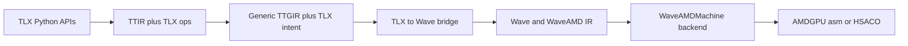

# TLX Wave Backend Design

## Status

Draft design for adding an alternative AMDGPU backend path for TLX kernels that
lowers TLX-rich Triton IR into the Wave/WaveAMD backend from
`https://github.com/hardcode84/7`. The Wave repository is intended to live as a
Triton submodule at `third_party/wave`, while Triton's integration wrapper lives
in `third_party/tlx_wave`.

This document intentionally targets TLX first. It is not a plan for a complete
generic Triton-to-Wave backend. The first goal is to preserve TLX's explicit
local-memory, layout, aliasing, and async intent and map that intent into Wave
IR before the existing AMD pipeline commits to AMD-specific TTGIR and LLVM
lowering decisions. The first target is `gfx950`, which does not use TDM in this
plan.

## Goals

- Compile a useful subset of TLX AMD kernels through the Wave backend.
- Keep the existing Triton/TLX frontend and most generic TTIR/TTGIR cleanup.
- Branch before AMD-specific TTGIR passes rewrite TLX intent into `amdg.*`,
  buffer, pipelining, and LLVM-oriented forms.
- Integrate Wave as a normal Triton build dependency through a submodule, but
  keep the initial bridge at the Python/textual MLIR layer because Wave uses its
  own LLVM.
- Support `tl.jit` launch selection through a dedicated `tlx_wave` backend
  target, initially stopping before real Wave lowering.
- Preserve TLX concepts that line up well with Wave:
  - explicit local buffer allocation and views;
  - explicit layout requirements;
  - explicit storage alias/reuse constraints;
  - explicit async tokens and waits;
  - dot/local-load layout constraints.
- Stage 1 stops at the TTGIR handoff boundary and stores the cutoff TTGIR as the
  `wave` artifact; later stages will emit Wave textual MLIR from Python.

## Non-Goals

- Full generic Triton compatibility in the first milestone.
- NVIDIA TLX features such as TMEM, WGMMA, TCGen5, TMA barriers, or warp-group
  async dot.
- Full atomics, reductions, scans, gathers, clusters, or multi-CTA CGA support
  in the first milestone.
- AMD TDM descriptor lowering in the first `gfx950` milestone.
- Reusing the final `compiled.asm["ttgir"]` artifact from the current AMD path
  as bridge input. That artifact is already AMD-shaped and has lost some of the
  TLX-level structure this backend wants to preserve.

## Background

TLX is already a low-level extension layer over Triton. It exposes hardware-near
operations such as:

- `tlx.local_alloc`, `tlx.local_view`, `tlx.local_trans`,
  `tlx.local_reshape`, and `tlx.local_reinterpret`;
- `tlx.local_load`, `tlx.local_store`, `tlx.local_gather`,
  and `tlx.local_scatter`;
- `tlx.async_load`, `tlx.async_load_commit_group`,
  and `tlx.async_load_wait_group`;
- AMD buffer ops and async global-to-local ops;
- AMD TDM descriptor loads and waits for later non-stage-1 targets;
- `tlx.require_layout` and `tlx.release_layout`;
- `tlx.storage_alias_spec`, `tlx.reuse_group`, and
  `tlx.set_buffer_overlap`;
- AMD `tlx.dot_scaled(..., tiles_per_warp=...)` hints.

Wave exposes a wave/subgroup programming model with:

- `!wave.simd<T, W>` for lane-varying values;
- `!wave.mask<W>` for logical lane masks;
- `!wave.mem.token` for explicit memory ordering;
- `!wave.ptr<#space, T>` for typed pointers;
- `wave.index_expr` for symbolic address algebra;
- `wave.where` for structured lane predication;
- `wave.load`, `wave.store`, `wave.barrier`, `wave.wait`, `wave.join`,
  and `wave.after`;
- WaveAMD operations such as `waveamd.make_buffer`, `waveamd.dma_load_lds`,
  `waveamd.fragment_pack`, and `waveamd.mma`.

This makes TLX a better initial source contract than generic TTGIR. TLX already
spells much of the ordering, memory, and layout intent that a Wave backend needs.

## Proposed Architecture

The new path branches from the AMD backend after generic Triton/TLX lowering but
before AMD-specific TTGIR transformations.

The first implementation is an integrated Triton backend scaffold:

- `third_party/tlx_wave/backend/compiler.py` registers a `tlx_wave` compiler
  target.
- `third_party/tlx_wave/backend/driver.py` lets `TRITON_DEFAULT_BACKEND=tlx_wave`
  select this path from ordinary `tl.jit` launches while reusing HIP device
  discovery.
- the compiler runs TTIR, TTGIR, and TLX passes, then stops before Wave lowering.
- the `wave` stage is a Python handoff point. It currently preserves the cutoff
  TTGIR as a textual artifact; later it will import Wave from `third_party/wave`
  and emit Wave/WaveAMD textual MLIR.

Textual MLIR remains the handoff because Triton/TLX and Wave may carry different
LLVM/MLIR builds.

## Cutoff Point

The durable cutoff is implemented as a separate in-tree backend,
`third_party/tlx_wave/backend/compiler.py`, rather than as an option inside
`HIPBackend.make_ttgir()`. This keeps the standard HIP backend unchanged and
makes the experimental path explicit through `GPUTarget("tlx_wave", "gfx950",
64)` or `TRITON_DEFAULT_BACKEND=tlx_wave`.

Keep:

- the full TLX-aware `make_ttir()` path;
- `passes.ttir.add_convert_to_ttgpuir`;
- generic TTGIR cleanup that does not commit to AMD-specific lowering:
  - `passes.ttgpuir.add_coalesce`;
  - `passes.ttgpuir.add_remove_layout_conversions`;
  - `passes.ttgpuir.add_f32_dot_tc`;
  - `passes.ttgpuir.add_optimize_thread_locality`, if it does not erase
    information the bridge needs.

Stop before:

- `amd.passes.ttgpuir.add_accelerate_matmul`;
- `tlx.tlx_passes.add_tlx_insert_require_layout` when it depends on AMD matmul
  layout choices;
- `amd.passes.ttgpuir.add_optimize_dot_operands`;
- AMD pipeline expansion and warp pipeline conversion;
- AMD buffer-op conversion;
- AMD shared-memory allocation;
- TritonAMDGPU-to-LLVM lowering.

The scaffold intentionally duplicates only the small pre-AMD subset of the HIP
pipeline needed for the handoff. If the paths converge later, this can be
refactored into a shared helper.

## TLX Concepts To Preserve

### Local Buffers And Views

TLX local memory APIs lower to `ttg.local_alloc` and `ttg.memdesc_*` view ops.
These should not be flattened too early.

Map:

- `ttg.local_alloc` to an LDS allocation record and eventually to
  `wave.lds_base {offset = ...}`;
- `ttg.memdesc_index`, `ttg.memdesc_subslice`, `ttg.memdesc_trans`,
  `ttg.memdesc_reshape`, and `ttg.memdesc_reinterpret` to structured address
  transforms;
- `ttg.local_load` to `wave.load` from `#wave.shared`;
- `ttg.local_store` to `wave.store` to `#wave.shared`.

The bridge should treat memdesc view chains as address algebra, not as opaque
values.

View lowering should be staged, not pre-flattened in Python. Each TTGIR view op
should contribute a small symbolic transform relative to its parent:

- `ttg.memdesc_index` adds a slot stride times the selected slot;
- `ttg.memdesc_subslice` adds the subslice base offset;
- `ttg.memdesc_trans` permutes the logical index tuple before delegating to the
  parent;
- `ttg.memdesc_reshape` remaps through a linearized logical element index;
- `ttg.memdesc_reinterpret` remaps through element-byte offsets and must reject
  incompatible element-size or alignment cases.

When a local load/store/DMA use materializes the final LDS pointer, the bridge
should emit one `wave.index_expr` for each stage and bind the previous stage's
result into the next stage. It may also emit chained `wave.ptr_add` operations
when that is the natural representation. The Wave pipeline's
`wave-combine-pointer-offsets` and `wave-simplify-index-exprs` passes are then
responsible for composing and canonicalizing the staged expressions.

The bridge must still know the TTGIR semantics of each view op. The Wave passes
can merge symbolic expressions; they cannot infer Triton view semantics from an
opaque offset.

### Layout Requirements

TLX layout constraints are high-value bridge input.

Map:

- `tlx.require_layout` on memdesc values to hard constraints on LDS address
  mapping;
- `tlx.require_layout` on tensor values to constraints on per-lane register
  grouping and WaveAMD fragment packing;
- `tlx.release_layout` to the point where a value can return to the default
  Wave representation.

The existing `tlx-propagate-layout` pass may still be useful, but it currently
sits after AMD matmul decisions in the AMD pipeline. For the Wave path, layout
propagation should either:

- run after the Wave bridge chooses equivalent layout constraints; or
- be partially re-used in a pre-AMD form that does not depend on AMD-specific
  encodings.

### Storage Alias And Reuse

TLX storage aliasing should feed the Wave LDS allocator.

Map:

- `tlx.storage_alias_spec` to an LDS allocation arena;
- `tlx.storage_alias_local_alloc` to a logical allocation inside that arena;
- `tlx.reuse_group` and `tlx.set_buffer_overlap` to overlap constraints;
- `tlx.local_alias` to a view of the computed backing allocation.

First milestone scope should support SMEM only. TMEM and NVIDIA-only storage
kinds should be rejected explicitly.

### Async Tokens And Waits

Wave memory ordering is explicit through `!wave.mem.token`. TLX async APIs are
already close to this model.

Map:

- `ttg.async_copy_global_to_local` or TLX async-load forms to `wave.load` plus
  `wave.store`, or to `waveamd.dma_load_lds` when the shape is supported;
- `ttg.async_commit_group` to `wave.join` or a bridge-level token group;
- `ttg.async_wait` to `wave.wait`;
- token-threaded waits to direct token dependencies;
- count-only waits to conservative `wave.wait` edges until a more precise
  scheduling model exists.

For correctness, the first bridge should conservatively thread tokens through
all side-effecting memory ops in program order per memory space. Later versions
can relax these edges.

### AMD TDM Descriptor Loads

TDM is out of scope for the first `gfx950` target. Keep this section as a later
target note.

TLX AMD descriptor APIs carry strong intent:

- `tlx.async_amd_descriptor_load`;
- `tlx.async_amd_descriptor_load_group`;
- `tlx.async_amd_descriptor_wait`;
- descriptor-compatible padded shared layouts.

The Wave repo already has `waveamd.dma_load_lds`, but exact TDM descriptor
semantics may require new WaveAMD operations. The first version can support the
simple equivalent cases and reject descriptor groups or unsupported descriptor
layouts.

### Dot And Scaled Dot

For TLX AMD matmul kernels, the bridge should prefer TLX local-load-to-dot
structure over final AMD matmul encodings.

Map:

- `ttg.local_load` feeding `tt.dot` to `wave.load` from LDS followed by
  `waveamd.fragment_pack`;
- `tt.dot` to `waveamd.mma`;
- `tt.dot_scaled` to `waveamd.mma_scale` where supported;
- `amdg.wmma_tiles_per_warp` metadata from `tlx.dot_scaled` to Wave tiling
  metadata or bridge-side MMA planning.

This should be a later milestone after global memory, LDS, and token mappings
work.

## Generic TTGIR-To-Wave Converter Requirements

The bridge must be a faithful converter for the supported TTGIR subset, not a
GEMM recognizer. Async GEMM is the first integration workload because it touches
local memory, async tokens, layouts, fragments, MMA, and stores, but the bridge
architecture should be organized around TTGIR op semantics and SSA values.

The converter should consume cutoff TTGIR directly:

- scalar and tensor arithmetic that produces addresses, masks, loop indices, and
  tile values;
- `ttg.local_alloc` plus `ttg.memdesc_*` view operations;
- `ttg.async_copy_global_to_local`, `ttg.async_commit_group`, and
  `ttg.async_wait`;
- `ttg.local_load` and `ttg.local_store`;
- `ttg.convert_layout` and other layout-changing ops;
- `tt.dot` and later `tt.dot_scaled`;
- ordinary `tt.load` / `tt.store`;
- no `amdg.*` operations.

The converter should maintain a typed Wave value for each TTGIR SSA value it
lowers. Pattern-level summaries such as `GemmLoopStatePlan` are useful only as
debug metadata derived from the generic SSA lowering, not as required lowering
inputs.

### 1. Module And Function Skeleton

- Parse the cutoff TTGIR textual module and identify the single public
  `tt.func` kernel.
- Preserve kernel arguments, scalar index arithmetic, block attributes,
  `num_warps`, and target metadata.
- Emit a Wave/WaveAMD function with equivalent kernel argument ABI metadata,
  leaving final HSACO lowering to the Wave toolchain.

### 2. Address And Index Planning

- Translate `tt.get_program_id`, `tt.make_range`, splats, scalar arithmetic,
  and tensor pointer arithmetic into Wave scalar values plus `wave.index_expr`.
- Classify each expression as uniform, lane-varying, or tile-varying.
- Preserve masks from pointer bounds checks and carry them into `wave.where`,
  predicated `wave.load`, or predicated DMA operations.
- Recover address and mask expressions by lowering the SSA producer graph for
  each pointer or predicate value. The lowering may initially support only a
  small op subset, but it should be expressed as op semantics, not as named
  GEMM A/B/C formulas.
- Reuse the same expression lowering for global loads, global stores, async
  copy sources, LDS offsets, and masks.

### 3. LDS Allocation And Memdesc Views

- Build an LDS allocation plan from each `ttg.local_alloc`.
- Support the first local-memory shape family:
  - SMEM only;
  - static element type and shape;
  - optional leading ring-buffer dimension;
  - no storage alias overlap initially.
- Map `tlx.local_view` / memdesc view operations to staged address transforms
  rather than to a single flattened Python-computed offset.
- Emit final LDS bases and offsets when a local load/store/DMA use needs a
  concrete shared-memory pointer.

### 4. Async Copy And Tokens

- Convert `ttg.async_copy_global_to_local` to either:
  - `waveamd.dma_load_lds` when the shape, alignment, and address expression fit
    WaveAMD DMA; or
  - a conservative `wave.load` from global plus `wave.store` to shared as the
    fallback.
- Treat DMA as a fast path, not as the correctness requirement. If source
  contiguity, mask uniformity, destination packet contiguity, alignment, or
  layout checks cannot prove a faithful `waveamd.dma_load_lds`, lower the copy
  through the load/store fallback when generic LDS addressing supports the
  destination. Copies with `other` fill values also use this fallback so inactive
  masked lanes are written with the requested fill value.
- Produce a `!wave.mem.token` for every side-effecting copy/store.
- Convert `ttg.async_commit_group` into a bridge token group, likely emitted as
  `wave.join` over the copy tokens.
- Convert `ttg.async_wait {num = N}` conservatively at first:
  - `num = 0` waits on all outstanding committed groups;
  - `num > 0` may wait on all groups until the bridge has a precise outstanding
    group model.
- Thread tokens through later LDS consumers so `ttg.local_load` cannot move
  before the relevant copy wait.

### 5. Local Loads And Dot Operands

- Translate `ttg.local_load` from a memdesc view into Wave shared loads.
- Interpret the result encoding, especially `#ttg.dot_op<{opIdx = 0|1,
  parent = ...}>`, as an MMA operand layout requirement.
- Pack loaded values into the fragment representation expected by WaveAMD, for
  example through `waveamd.fragment_pack` or an equivalent bridge-side helper.
- Reject unsupported local-load layouts with a diagnostic that includes the
  original TTGIR encoding.

### 6. MMA Lowering

- Lower each supported `tt.dot` to the corresponding WaveAMD MMA op.
- Start with one shape family:
  - `f16 x f16 -> f32`;
  - wave64;
  - static `BLOCK_M`, `BLOCK_N`, and `BLOCK_K`;
  - one CTA;
  - no split-K or multi-CTA accumulation.
- Preserve accumulator SSA flow across the async pipeline loop.
- Keep `tt.dot_scaled` and custom `tiles_per_warp` support out of the first
  async GEMM bridge unless needed by the chosen test kernel.

### 7. Control, Pipeline, And Token State

- Represent control flow using the TTGIR/SCF op structure. A double-buffered
  GEMM loop should fall out of generic handling for loop-carried SSA values,
  token groups, and memdesc view indices.
- Track memory tokens as first-class values. Async waits, barriers, local
  stores, local loads with token operands, and global stores should all consume
  and produce explicit Wave tokens where Wave requires ordering.
- Ring-buffer slots are ordinary SSA/index expressions feeding memdesc view
  operations. They should not require a GEMM-specific side table.
- Do not rely on AMD pipeline passes. The bridge owns token and memdesc-view
  semantics once it branches before AMD lowering.

### 8. Generic Stores

- Lower `tt.store` from its pointer, value, and optional mask operands, using
  the same address and mask expression lowering used for loads.
- Choose the store representation from the lowered Wave value type:
  - SIMD scalar/vector values use `wave.store`;
  - fragment values use `waveamd.fragment_unpack` plus `wave.store` or
    `wave.fragment_store` when the target layout is supported;
  - unsupported layout conversions fail before store emission.
- Preserve store masks with `wave.where`.
- Keep stores ordered after relevant memory dependencies. Arithmetic-only Wave
  values do not produce tokens, so the converter should thread the latest
  memory token conservatively until a more precise dependency model is added.

### Rejected Prototype Shape

Do not build the bridge around a GEMM-specific recognizer. In particular:

- do not introduce lowering-required records named around GEMM loop state;
- do not infer the bridge stage from the presence of `tt.dot` plus `tt.store`;
- do not lower `tt.store` only when its source is a final GEMM accumulator;
- do not reconstruct A/B/C formulas by name. Lower the underlying SSA graph
  instead;
- do not accept a layout merely because the current GEMM fixture happens to use
  it. Layout validation must be explicit and tied to the Wave value emitted.

### Current Structural Subset

The implemented bridge is currently a straight-line public-kernel converter. It
accepts exactly one public `tt.func` and rejects any additional private/helper
`tt.func` definitions before planning, because helper calls would otherwise be
ignored or flattened without preserving function structure.

Within the public kernel body, nested-region and control-flow ops such as
`scf.if`, `scf.for`, and region-yielding pipeline constructs are rejected before
Wave emission. Supporting these requires a region-preserving lowering state that
maps block arguments, loop-carried SSA values, and memory tokens through the
corresponding Wave/SCF structure; flattening nested ops into the top-level Wave
function is not a valid fallback.

### Initial Unsupported Cases

The first converter should reject these explicitly:

- TDM descriptor loads and stores;
- private/helper `tt.func` definitions;
- nested-region or control-flow ops until region-preserving lowering is added;
- dynamic tile shapes or dynamic LDS allocation sizes;
- storage alias overlap;
- TMEM or NVIDIA-only TLX storage;
- `tt.dot_scaled`;
- multiple CTAs per program;
- non-`f16` MMA operands;
- atomics, reductions, or epilogue fusion beyond cast plus store;
- layouts that cannot be mapped from TTGIR encodings to Wave fragment layout.

### Suggested First Acceptance Test

Use the async double-buffer GEMM probe as the first integration test, but pair it
with smaller TTGIR op-level tests for address expressions, masks, token
threading, local loads, dot, and stores. The GEMM probe should lower from cutoff
TTGIR containing:

- two `ttg.local_alloc` ops;
- four `ttg.async_copy_global_to_local` ops;
- two `ttg.async_commit_group` ops;
- two `ttg.async_wait` ops;
- four `ttg.local_load` ops;
- two `tt.dot` ops;
- one `tt.store` op;
- zero `amdg.*` ops.

The first passing criterion should be `wave-opt` acceptance of the emitted
Wave/WaveAMD textual MLIR. That emitted MLIR must come from generic TTGIR op
lowering. Runtime correctness can follow once Wave lowering and HSACO loading
are wired into the Triton backend.

## Data Model In The Bridge

The bridge needs an explicit internal representation instead of a pure op-to-op
rewrite.

Suggested core records:

- `ValuePlan`: maps each TTGIR SSA value to uniform scalar, lane-varying SIMD,
  vector payload, fragment, token, or memdesc view.
- `WaveValue`: records the Wave SSA value or values produced for a TTGIR SSA
  value, including its representation kind. Store and dot lowering should branch
  on this representation rather than on kernel-level patterns.
- `LayoutPlan`: interprets TTGIR/TLX encodings into lane/register ownership and
  staged LDS address transforms. Layout facts should come from typed Triton
  Python bindings or C++ layout helpers, not from parsing attribute text.
- `MemDescPlan`: tracks allocation base, shape, element type, layout, views, and
  alias arena.
- `TokenPlan`: tracks conservative memory dependencies and explicit async tokens.
- `AddressExprPlan`: recovers symbolic expressions for pointer and LDS offsets,
  then emits staged `wave.index_expr` values that the Wave canonicalization
  pipeline can merge.
- `OpLoweringState`: owns the mapping from TTGIR SSA values to `WaveValue`,
  token values, and control-flow scope state while lowering operations in order.
  This is where loop-carried values are represented; it should not be specialized
  as GEMM loop state.

The most important part is `LayoutPlan`: TTGIR tensors are distributed tensors,
while Wave values are explicit per-wave lane values. The bridge must interpret
TTGIR layout attributes and decide how many Wave values or vector payload
components represent each logical tensor.

## Mapping Summary

| TLX / TTGIR input | Wave output | Notes |
| --- | --- | --- |
| `tl.program_id(axis)` | `wave.workgroup_id` | Direct for grid axes. |
| `tl.arange` / `tt.make_range` | `wave.lane_id` plus `wave.index_expr` | Requires layout interpretation. |
| `tl.load` / `tlx.buffer_load` | `wave.load` | Masks become `wave.where` or select. |
| `tl.store` / `tlx.buffer_store` | `wave.store` | Predicated stores use `wave.where`. |
| `tlx.local_alloc` | `wave.lds_base` plus allocation offset | Allocation planned by bridge. |
| `tlx.local_view` | offset in `MemDescPlan` | Emits no op unless needed for address. |
| `tlx.local_trans` | transformed address expression | Needs shared-layout support. |
| `tlx.local_load` | `wave.load` from shared pointer | Token dependency optional or explicit. |
| `tlx.local_store` | `wave.store` to shared pointer | Produces token. |
| `tlx.require_layout` | hard `LayoutPlan` constraint | Do not silently ignore. |
| `tlx.storage_alias_spec` | LDS arena | SMEM first. |
| `tlx.async_load` | `waveamd.dma_load_lds` or load/store pair | Depends on supported shape. |
| `tlx.async_load_wait_group` | `wave.wait` | Conservative for count-only waits. |
| `tlx.async_amd_descriptor_load` | `waveamd.dma_load_lds` or new op | TDM exactness is open. |
| `tt.dot` | `waveamd.mma` | Later milestone. |
| `tt.dot_scaled` | `waveamd.mma_scale` | Later milestone. |

## Prototype Milestones

### Milestone 1: Integrated Cutoff Scaffold

Add an in-tree `tlx_wave` backend installed by the normal Triton pip/editable
build. It should accept ordinary `tl.jit` kernels, run the TLX-aware frontend,
TTIR, TTGIR, and pre-AMD cleanup, then stop before TTGIR-to-Wave lowering.

Success criteria:

- `TRITON_DEFAULT_BACKEND=tlx_wave` selects the backend from normal `tl.jit`
  launch code.
- A TLX AMD test kernel can produce the cutoff TTGIR artifact.
- The dump still contains `ttg.local_alloc`, `ttg.memdesc_*`,
  `ttg.local_load`, `ttg.async_*`, and TLX layout/alias ops where applicable.
- Launch attempts fail with a clear scaffold diagnostic instead of trying to
  load a fake GPU binary.

### Milestone 2: Async Load To LDS POC

Target a kernel shaped like:

1. `tlx.local_alloc`;
2. `tlx.async_load`;
3. `tlx.async_load_commit_group`;
4. `tlx.async_load_wait_group`;
5. `tlx.local_load`;
6. global `tl.store`.

Candidate test: `_async_load_kernel` in
`python/test/unit/language/test_tlx_amd.py`.

Success criteria:

- The bridge emits valid Wave MLIR.
- Memory operations are token-threaded.
- LDS addressing is expressed via `wave.lds_base`, `wave.ptr_add`, and
  `wave.index_expr`.
- `wave-opt` accepts the module.

### Milestone 3: Layout And Alias Support

Support explicit TLX shared layouts and SMEM storage aliasing.

Success criteria:

- Explicit padded layout is preserved for a simple TDM-compatible buffer.
- Conflicting explicit layouts fail loudly.
- A simple `storage_alias_spec` produces one LDS arena with correct offsets.
- Memdesc view chains are emitted as staged `wave.index_expr` / `wave.ptr_add`
  operations, and a test runs `wave-combine-pointer-offsets` plus
  `wave-simplify-index-exprs` to prove the Wave pipeline can fold the stages.

### Milestone 4: TDM Descriptor POC

Support a simple `tlx.async_amd_descriptor_load` / wait / local-load sequence
for a later target where TDM is part of the plan.

Candidate tests:

- TDM descriptor tests in `python/test/unit/language/test_tlx_amd.py`;
- simple cases from `third_party/tlx/tutorials/amd-fa-tdm-pipelined_test.py`.

Success criteria:

- Descriptor offsets lower to structured `wave.index_expr`.
- Descriptor and memdesc view offsets are emitted as staged expressions rather
  than as one bridge-precomposed string.
- The result buffer layout is represented in the LDS address plan.
- Unsupported descriptor groups are rejected with a clear diagnostic.

### Milestone 5: One-Wave Dot POC

Support a one-wave or single-subgroup `local_load -> tt.dot` path.

Success criteria:

- LDS operand loads become `wave.load` plus `waveamd.fragment_pack`.
- Dot becomes `waveamd.mma`.
- Accumulator storage and final stores are correct for one tile.

## Open Questions

- Should the bridge run any TLX layout propagation before conversion, or should
  it consume raw `tlx.require_layout` constraints directly?
- Should count-only async waits be modeled as conservative full waits in Wave, or
  should the bridge attempt to reconstruct precise outstanding groups early?
- Do AMD TDM descriptor loads need new WaveAMD ops for exact codegen, or can they
  be lowered through existing `waveamd.dma_load_lds` for the first useful subset?
- How much of `tlx.dot_scaled(..., tiles_per_warp=...)` should become Wave IR
  metadata versus bridge-side MMA planning?
- Which exact Python API from the Wave submodule should own textual MLIR
  construction for the first real bridge?

## Initial Recommendation

Start with the integrated `tlx_wave` cutoff scaffold and keep the first real
lowering subset narrow: `gfx950`, SMEM, affine global memory, local views, async
global-to-LDS, conservative tokens, and simple masks. Treat TLX layout and alias
operations as source-of-truth constraints. Add dot and TDM only after the memory
and LDS model is stable.
