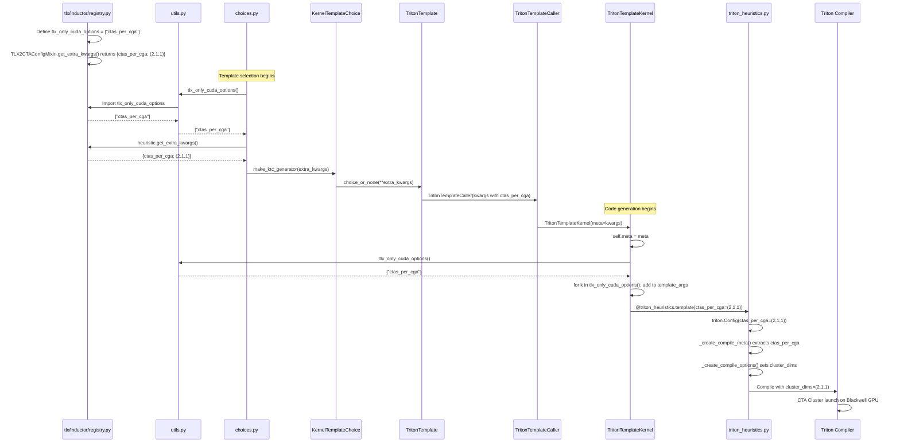

# tlx_only_cuda_options Flow in Inductor TLX Templates

This document shows how `tlx_only_cuda_options` (e.g., `ctas_per_cga`) flows from the TLX template heuristic configuration to the Triton kernel decorator.

---

## Complete Data Flow



---

## Adding a New tlx_only_cuda_option

To add a new FB-only option (e.g., `my_new_option`):

1. **Add to registry.py**:
   ```python
   tlx_only_cuda_options = ["ctas_per_cga", "my_new_option"]
   ```

2. **Return from get_extra_kwargs()**:
   ```python
   def get_extra_kwargs(self, kernel_inputs, op_name):
       return {"ctas_per_cga": (2, 1, 1), "my_new_option": value}
   ```
